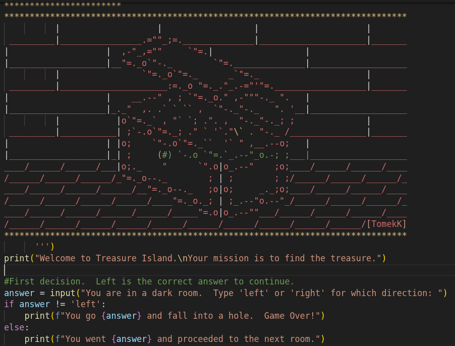
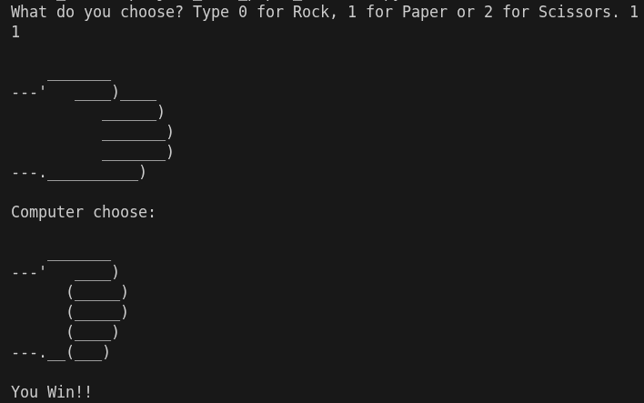
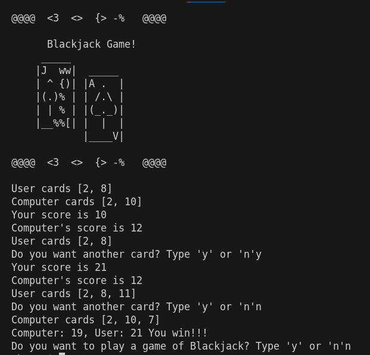
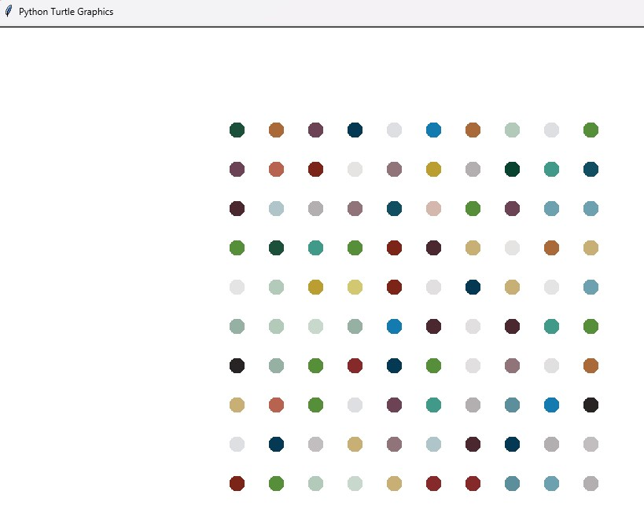
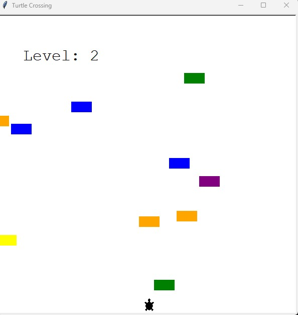
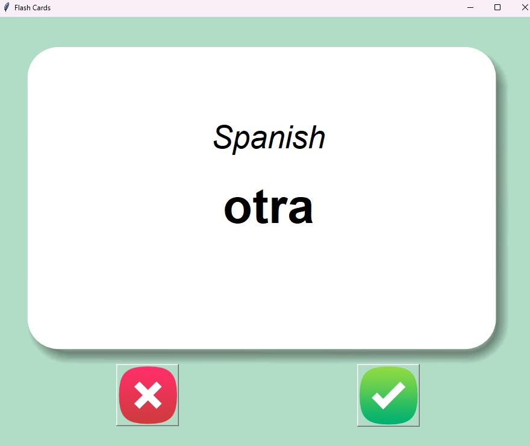

# PythonBootCamp
 Training on Python - resources by Angela Yu on Udemy 

 **Below are learnings and projects using Python 3.13.11 (unless otherwise stated)** 
 * Sample Beginning: 
 <t>- Day 3 - Control Flow, logical operators and modulo.  Project: Treasure Island 'choose your adventure game. 
 <t><t><t> 
 <t>- Day 4 - Randomization and lists.  Project: Rock, Paper and Scissors game. 
 <t><t><t> 
 <t>- Day 11 - Capstone Project: Blackjack. 
 <t><t><t> 
 * Sample Intermediate: 
 <t> - Day 18 - Hirst like Painting program. 
 * <t><t><t> 
 * <t>- Day 23 - Capstone Project: Turtle Crossing game. 
 <t><t><t> 
 <t>- Day 31 - Capstone Project: Language Flash cards. 
 <t><t><t> 
